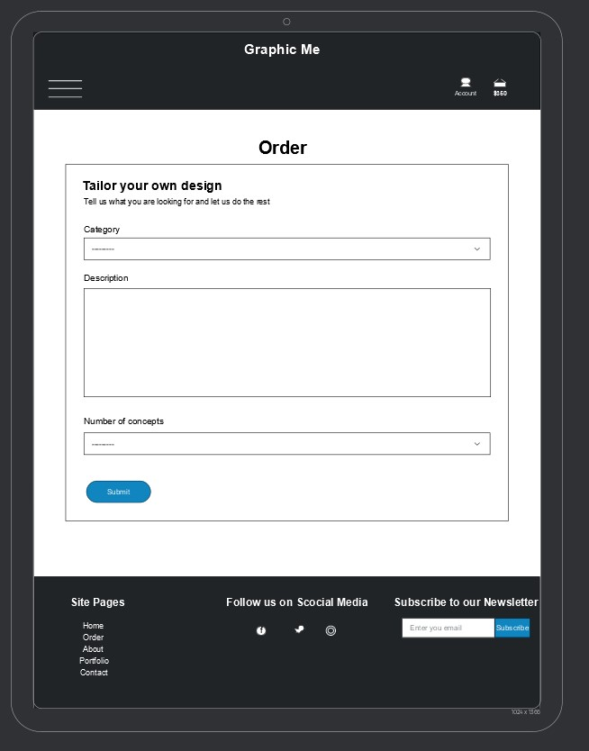

# Graphic Me

Graphic Me is a graphic design service. This website is allows user to search previous work done by the graphic design company, create a user profile account and order custom graphic for their needs. 

Live website: https://graphic-me.herokuapp.com/

## Table of Content
1. [User Experience](#user-experience)
    1. [Target Audience](#target-audience)
    2. [User Stories](#user-stories)
        1. [Site Owner](#site-owner)
        2. [User](#user)
3. [Design](#design) 
    1. [Wireframes](#wireframes)
    2. [Colour](#colours)
    3. [Fonts](#fonts)
4. [Features](#features)
    1. [Portfolio Display](#portfolio_display_section)
    2. [Portfolio Detail Display](#portfolio_display_section_section)
    3. [User Profile](#user_profile_section)
    4. [User Testimonials](#user_testimonials_section)
    5. [User Searching](#user_searching_section)
    6. [User Order Form](#user_order_form_section)
5. [Technologies Used](#technologies-used)
    1. [Languages](#languages)
    2. [Frameworks & Tools](#frameworks-&-tools)
6. [Testing](#testing)
    1. [HTML Validation](#HTML-validation)
    2. [CSS Validation](#CSS-validation)
    3. [Accessibility](#accessibility)
    4. [Performance](#performance)
8. [Bugs](#Bugs)
9. [Deployment](#deployment)
10. [Credits](#credits)
    1. [site Images](#site-images)
11. [Acknowledgements](#acknowledgements)

## User Experience

### Target Audience
- People looking for a grahic design service
- People who want to know the graphic designers history in the industry.

### User Stories
#### Site Owner
- As a Site Owner  I can view customers orders so that I can track their progress and trends
- As a Site Owner  I can add, edit and delete items in the portfolio so that manage the site gallery
- As a Site Owner I can upload completed work so that I can complete a customers order
- As a Site Owner, I want to receive feedback from the user.

#### User 
- As a User I can create an account so that make purchases and track orders
- As a User I can easily login and logout so that access my information
- As a User I can recover my password so that I don’t get locked out of my account
- As a User I can receive a confirmation email when I register an account so that I am certain of the creation of my account
- As a User I can create a custom order so that I can buy a graphic
- As a User I can easily enter payment details so that checkout quickly
- As a User I can view my orders so that I can see the order progress and download my completed products
- As a User I can access my shopping cart so that view my current order
- As a User I can easily see the est cost of my order so that I can track my spending
- As a User I can search keywords so that navigate the site easily
- As a User I can I can sort items in the portfolio so that narrow down my search
- As a User I can see the search results title and the number of results so that to quickly see what items and how many are there
- As a User I can leave a review so that I can tell the site owner what I thought of the service
- As a User I can view products details in the portfolio so that a better understanding of the skillset

Portfolio Display Image

 

## Design

### Wireframes

Home Page

 

Desktop View

 

Tablet View

 

Moblie View

Portfolio Page

 

Desktop View

 

Tablet View

 

Moblie View

Order Page

 

Desktop View

 

Tablet View

 

Moblie View

About Page

 

Desktop View

 

Tablet View

 

Moblie View

### Colour

Colour Chioce Image

 

### Fonts
- 

## Features

### Portfolio Display
- This section allows the user to browse all categories in the portfolio

Portfolio Display Image

 

### Portfolio Detail Display
- This section allows the user to view a portfolio item and it's details
 

Portfolio Detail Display Image

 

### User Profile
- This section allows the user to see their profile

### User Testimonials 
- This section allows users to leave a testimonial and it to be displayed on the home page of the site

### User Searching
- This section allows users to search key words from the seachbar in the navigation menu

User Searching Image

 

### User Order Form
- This section allows user to greate and customise and order

Order Form Image

 

## Technologies Used

### Languages
- HTML
- CSS
- Python

### Frameworks & Tools
- Git
- GitHub
- Gitpod
- Django
- Bootstrap4
- Pillow
- Allauth

## Testing 

| **Feature** | **Action** | **Expected Result** | **Manual Testing** | **Actual Result** |
|-------------|------------|---------------------|-------------------|--------------------|
| Product Detail | This allows using to get a closeup of the product and read about the product | Click on the image in the portfolio page and be brought to the Product detail page | This was done by clicking the image | Worked as expected | 

### Performance
### HTML

- 

### CSS
- 

### Javascript
- 

### Lighthouse

- 

## Bugs
| **Feature / Function** | **Expected Result** | **Actual Result** | **Action** |
|-------------|------------|---------------------|-------------------|
| Discount applied after order reaches threshold | When the user has ordered more that the discount threshold the 10% discount will be applied to their order | When the user orders over the threshold 10% of the cost id added to the order | In bag/context.py change grand_total = total + discountto grand_total = total - discount |
| The user creates an order and the total price is displayed | Match the users orders with the model to get the price of items | The fuction returned just the category id | I used category_item = Category.objects.all().values() to retrieve all valuse from the model |

## Deployment
Heroku and AWS was used for the deployment of this program.

### Heroku
1. In the workspace terminal command line: "pip3 freeze > requirements.txt"
2. Create account on Heroku
3. On the dashboard page, select "create new app"
4. Click create app
5. Go to the "settings" tab, find "Config Vars" completed the following convig vars: STRIPE_WH_SECRET, USE_AWS, AWS_ACCESS_KEY_ID, AWS_SECRET_ACCESS_KEY, DATABASE_URL, and SECRET_KEY
6. In settings find add buid packs to app
    1. python
6. Scroll up to the navigation menu and find "deploy", select GitHub as deployment method
7. In the Deployment Method section select Gitub or connect to GitHub
8. In the "Connect to GitHub, searh the desired repository
9. Enable automatic deploys and then deploy branch
10. Once deployed click on "View" to open aplication
 

### AWS
1. Create an AWS account on aws.amazon.com
2. In the services menu search for s3
2. In s3, create a bucket
3. In the bucket navigate to the Properties tab and turn on static website hosting
4. In the Permissions setup the CORS Configeration, Bucket Policy and set up Permissions for public access
5. In the services menu search for IAM
6. Next navigate to User Groups and create group
7. Next fnd the policy tab and create a policy
8. Click generate policy and import AmazonS3FullAccess policy
9. Add the bucket arn to policy
10. Attatch the policy to the group
11. Create user to add to the group
12. Add the Keys to the project and Heroku config vars
 

## Credits
### Site Images
- Fish&Co. - Image by pexels.com
- Nothing to see here - Image by Aleksandar Pasaric, sourced from pexels.com
- Route 66 - Image by Daniel Nettesheim, sourced from pexels.com
- All you need is coffee - Image by Iselene Kei Borromeo Marzan, sourced from pexels.com
- Planet Earth First - Image by Lauris Rozentals, sourced from pexels.com
- Jamillee - Image by Mommam Pacharapan, sourced from pexels.com
- Doubt- Image by Olya Kobruseva, sourced from pexels.com
- Violet - Image by T-rex, sourced from pexels.com